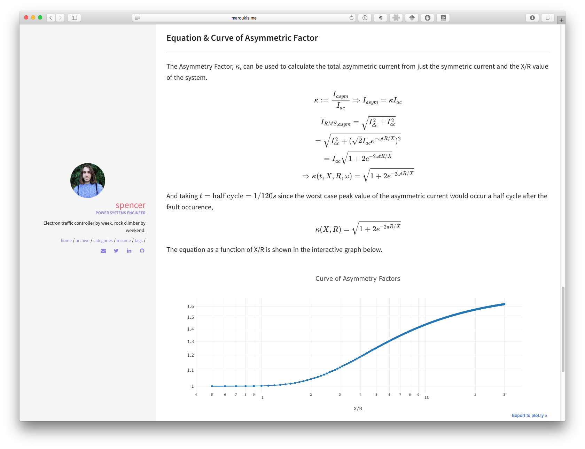
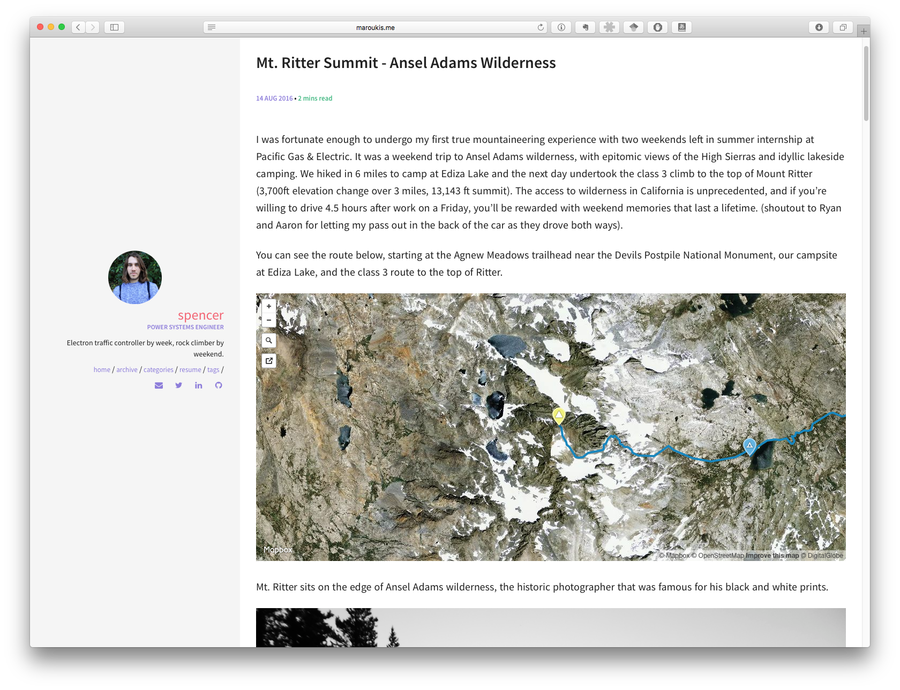

This is my personal blog for formulating ideas around electrical engineering, power systems and the clean energy transition. Ocassionally I will venture outside for some fresh air and share that too.

Link to homepage: [smaroukis.github.io](https://smaroukis.github.io) or [maroukis.me](https://maroukis.me).

Screens:

I'll be sporadically updating [this blog post][https://maroukis.me/blog/how-to-guide-jekyll-docker-travis-github] with my current workflow including info on:
 - extending themes
 - using unsupported plugins on Github pages by building with Travis
 - using KaTeX for TeX rendering instead of MathJax whilst using kramdown
 - runarounds with Docker on Windows and Linux
 - adding footnotes to captions

Made with [jekyll](https://jekyllrb.com) and the [leonids](https://github.com/renyuanz/leonids/) theme. Deployed with [travis](https://travis-ci.org). Hosted on Github Pages.
