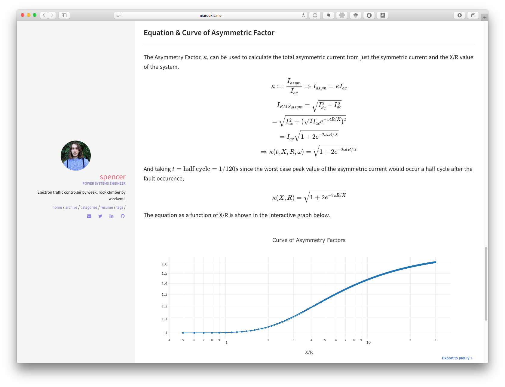
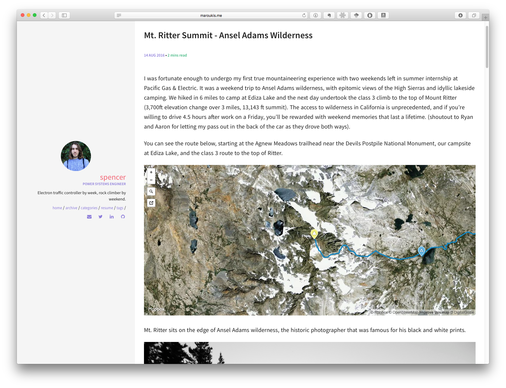

Personal blog for formulating ideas around power systems engineering, the clean energy transition, rock climbing/mountaineering adventures, and (hopefully soon) map-making.

Link to homepage: [smaroukis.github.io](https://smaroukis.github.io) or [maroukis.me](https://maroukis.me).

Screens:

Made with [jekyll](https://jekyllrb.com) and the [leonids](https://github.com/renyuanz/leonids/) theme. Deployed with [travis](https://travis-ci.org). Hosted on Github Pages.
